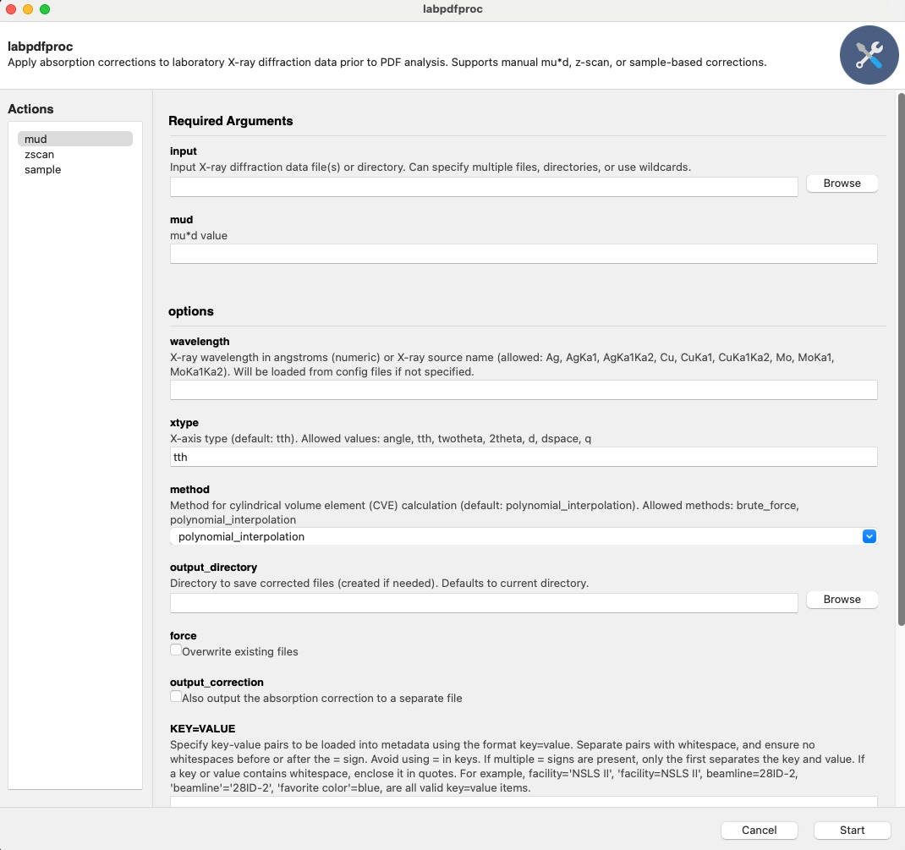

:tocdepth: -1

labpdfprocapp Example
#####################

This example provides a quick-start tutorial for using ``diffpy.labpdfproc``
to apply absorption correction to your 1D diffraction data using the command-line (CLI).
Check ``labpdfproc --help`` for more information.
A graphical user interface (GUI) is also available and is designed to be intuitive and easy to use.

There are three ways to correct dirraction data within ``diffpy.labpdfproc``, these are,

1. ``labpdfproc mud``: Provide the diffraction data file(s) and muD value directly.
2. ``labpdfproc zscan``: Provide the diffraction data file(s) and a z-scan file, which will be used to calculate the muD value.
3. ``labpdfproc sample``: Provide the diffraction data file(s) and information about the sample to calculate the theoretical muD value.

We will go through all three methods in this tutorial.

.. admonition:: Example Data

    Example data for these examples can be found at: https://github.com/diffpy/diffpy.labpdfproc/tree/main/docs/source/examples/example-data

Launching the Graphical User Interface (GUI)
--------------------------------------------

To launch the GUI, run one of the following commands in your terminal,

.. code-block:: bash

   labpdfproc
   labpdfproc --gui

.. note:: Note that the GUI is currently not supported on Python>=3.12.

This will open the GUI, which should look something like,

Below we will go through all the commands using the CLI, but the same principles apply to the GUI.

.. note:: The first time you run any of the below commands,
    you will be prompted to enter your name, email, and ORCID. This will be
    appended to metadata in the output file header for reproducibility and tracking purposes.

``labpdfproc mud`` Command
---------------------------

If you know the muD value for your sample, you can use the ``labpdfproc mud``
command to apply absorption correction directly.

To see all the options for this command, type,

.. code-block:: bash

    labpdfproc mud -h

To run the correction, specify the path to your diffraction data file(s) and the muD value,

.. code-block:: bash

    labpdfproc mud <diffraction-data-file.xy> <mud>
    labpdfproc mud zro2_mo.xy 2.5

If the flag ``--wavelength`` is not specified, the program will attempt to fetch
the wavelength from a configuration file.
If the wavelength is not found in the configuration file, a ``ValueError``
will be raised, prompting you to provide the wavelength either through the CLI or the configuration file.

To provide the wavelength through the CLI, you can use the ``-w`` or ``--wavelength`` flag followed by the wavelength value in angstroms or the X-ray source.
For example,

.. code-block:: bash

    labpdfproc mud zro2_mo.xy 2.5 -w 0.71303
    labpdfproc mud zro2_mo.xy 2.5 -w Mo

This will then save the corrected file in the same directory as the input file with the name ``zro2_mo_corrected.chi``.

To save the correction file, specify the ``-c`` or ``--output-correction`` flag,

.. code-block:: bash

    labpdfproc mud zro2_mo.xy 2.5 -w 0.71303 -c

This will then save the correction file in the same directory as the input file with the name ``zro2_mo_cve.chi``.

``labpdfproc zscan`` Command
----------------------------

The ``labpdfproc zscan`` command allows you to calculate the muD value from a z-scan file and apply absorption correction to your diffraction data.
For more information on what a z-scan is, please see the "Examples --> Linear Absorption Coefficient Examples"
section in the ``diffpy.utils`` documentation: https://www.diffpy.org/diffpy.utils/examples/mu_calc_examples.html.

To see the options for this command, type,

.. code-block:: bash

    labpdfproc zscan -h

To run this command, provide the path to your diffraction data file(s) and the z-scan file,

.. code-block:: bash

    labpdfproc zscan <diffraction-data-file.xy> <zscan-file.xy>
    labpdfproc zscan CeO2_635um_accum_0.xy CeO2_635um_zscan.xy

Like the ``labpdfproc mud`` command, you can also specify the
wavelength or source type using the ``-w`` flag if it's not found in the configuration file,

.. code-block:: bash

    labpdfproc zscan CeO2_635um_accum_0.xy CeO2_635um_zscan.xy -w 0.71303
    labpdfproc zscan CeO2_635um_accum_0.xy CeO2_635um_zscan.xy -w Mo

This will save the corrected file in the same directory as the input file with the name ``CeO2_635um_accum_0.chi``.

To save the correction file, specify the ``-c`` or ``--output-correction`` flag,

.. code-block:: bash

    labpdfproc zscan CeO2_635um_accum_0.xy CeO2_635um_zscan.xy -w 0.71303 -c

This will then save the correction file in the same directory as the input file with the name ``CeO2_635um_accum_0_cve.chi``.

``labpdfproc sample`` Command
-----------------------------

The ``labpdfproc sample`` command allows you to calculate the muD value from information
about your sample and apply absorption correction to your diffraction data.

To see the options for this command, type,

.. code-block:: bash

    labpdfproc sample -h

To run this command, provide the path to your diffraction data file(s) along with:

1) ``sample_composition``: The chemical formula of your sample.
2) ``sample_mass_density``: The mass density of your sample in g/cm^3. If you don't know the mass density, a good approximation is typically ~1/3 of the theoretical packing fraction.
3) ``diameter``: The outer diameter of your capillary.

.. code-block:: bash

    labpdfproc sample <diffraction-data-file.xy> <sample_composition> <sample_mass_density> <diameter>
    labpdfproc sample zro2_mo.xy ZrO2 17.45 1.2

Once again, you can specify the wavelength or source type using the ``-w`` flag if it's not found in the configuration file,

.. code-block:: bash

    labpdfproc sample zro2_mo.xy ZrO2 17.45 1.2 -w 0.71303
    labpdfproc sample zro2_mo.xy ZrO2 17.45 1.2 -w Mo

This will save the corrected file in the same directory as the input file with the name ``zro2_mo.chi``.

To save the correction file, specify the ``-c`` or ``--output-correction`` flag,

.. code-block:: bash

    labpdfproc sample zro2_mo.xy ZrO2 17.45 1.2 -w 0.71303 -c

This will then save the correction file in the same directory as the input file with the name ``zro2_mo_cve.chi``.

Additional CLI options
----------------------

Below is a summary of all the additional flags that can be used with all three commands,

- ``-h, --help``
  Show this help message and exit.

- ``-w, --wavelength WAVELENGTH``
  X-ray wavelength in angstroms (numeric) or X-ray source name.
  Allowed: ``Ag``, ``AgKa1``, ``AgKa1Ka2``, ``Cu``, ``CuKa1``, ``CuKa1Ka2``, ``Mo``, ``MoKa1``, ``MoKa1Ka2``.
  Will be loaded from config files if not specified.

- ``-x, --xtype XTYPE``
  X-axis type (default: ``tth``). Allowed values: ``angle``, ``tth``, ``twotheta``, ``2theta``, ``d``, ``dspace``, ``q``.

- ``-m, --method {brute_force, polynomial_interpolation}``
  Method for cylindrical volume element (CVE) calculation (default: ``polynomial_interpolation``).
  Allowed methods: ``brute_force``, ``polynomial_interpolation``.

- ``-o, --output-directory OUTPUT_DIRECTORY``
  Directory to save corrected files (created if needed). Defaults to current directory.

- ``-f, --force``
  Overwrite existing files.

- ``-c, --output-correction``
  Also output the absorption correction to a separate file.

- ``-u, --user-metadata KEY=VALUE [KEY=VALUE ...]``
  Specify key-value pairs to be loaded into metadata. Format: ``key=value``.
  - Separate multiple pairs with whitespace.
  - No spaces before or after ``=``.
  - Avoid using ``=`` in keys. Only the first ``=`` separates key and value.
  - If a key or value contains whitespace, enclose it in quotes.
    Examples:
    ``facility='NSLS II', beamline=28ID-2, 'favorite color'=blue``.

- ``--username USERNAME``
  Your name (optional, for dataset credit). Will be loaded from config files if not specified.

- ``--email EMAIL``
  Your email (optional, for dataset credit). Will be loaded from config files if not specified.

- ``--orcid ORCID``
  Your ORCID ID (optional, for dataset credit). Will be loaded from config files if not specified.
